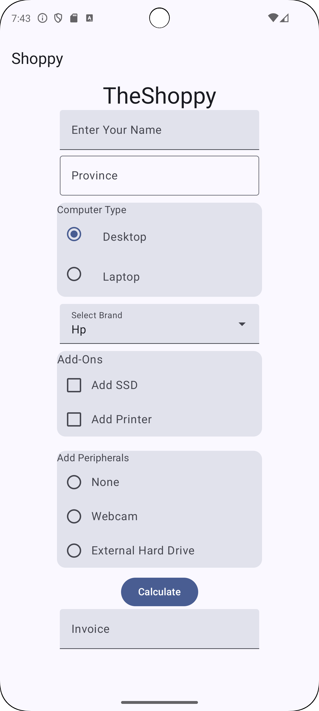
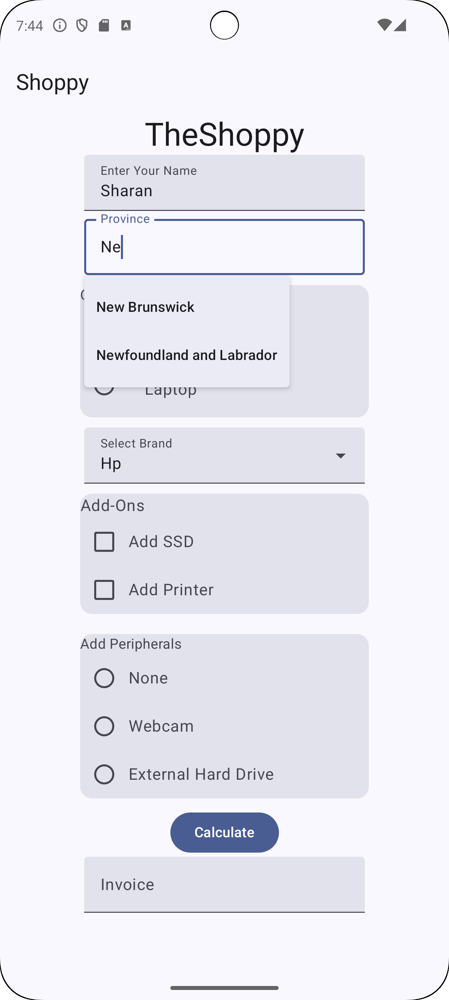
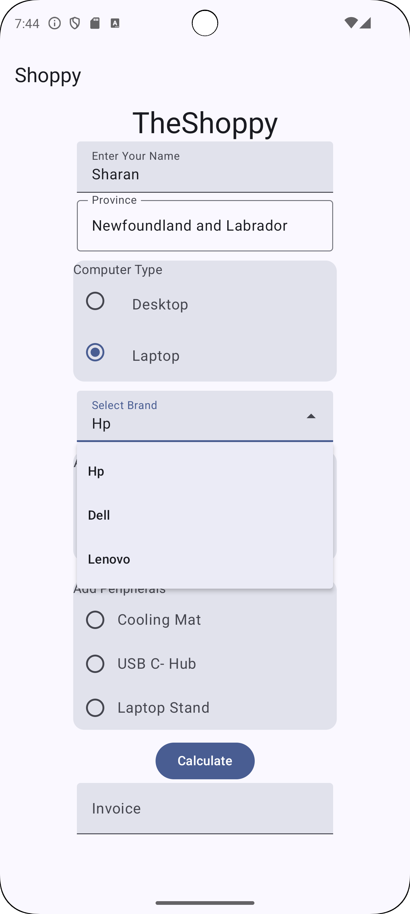
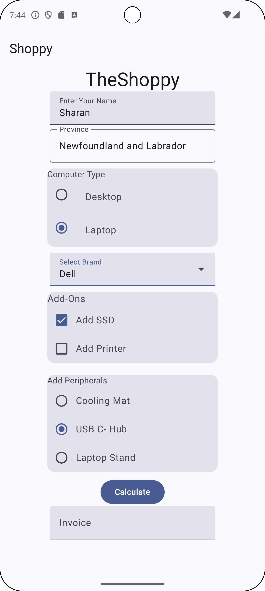
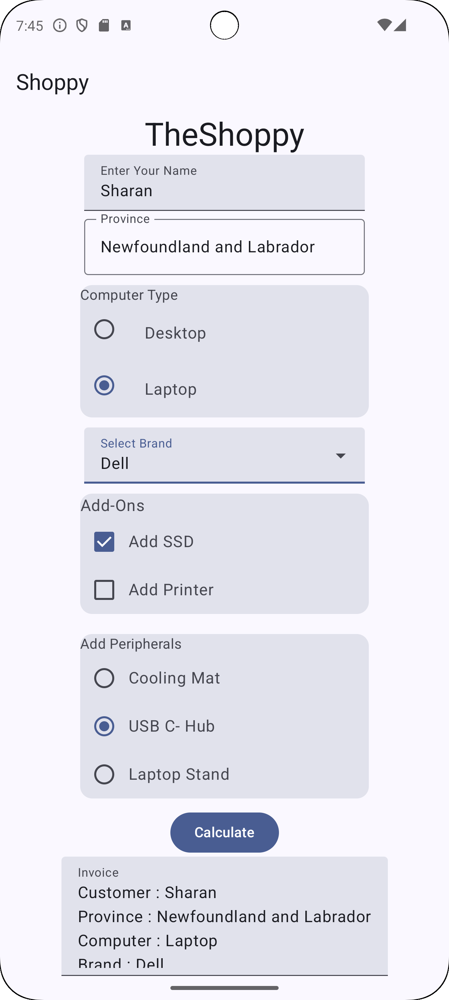
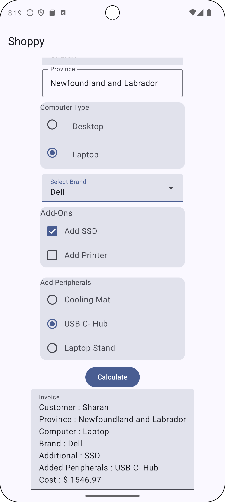

# ShoppyApp

A single page application, demonstrating some UI features, generally used in Forms, along with illustrating datastore preference.

The application basically asks for various information from the customer. This includes UserName, Province Name, Computer Type, Brand name, Add-ons, and peripherals. After the user clicks on the Calculate button, the application performs calculation by adding the specific cost as per user choice and also adding a 13% tax. Then, this calculation, along with the information is stored in datastore and retreived from local storage to display as an Invoice in TextView. 

## Screenshots

## Features

- AutoComplete TextView : The field asks to input Province name and as soon as user enters two letters, it shows the suggestions in a dropdown format.
- RadioButton : Radiogroup execution allows only single option to be chosen for computer types.
- Dropdown : In the latest tech Jetpack Compose, ExposedDropdownMenuBox is is use to achieve this.
- Checkbox : Optional choice provided to the customer for Add-Ons.
- Manipulative Radiogroup : The radiogroup options depending upon the previous radiobutton selection i.e. when Laptop is selected, the options for peripherals are Cooling Mat, USB and Laptop Stand whereas when desktop is selected as computer type, the existing peripherals include Webcam, Harddrive and None.
- DataStore Preference : Used to store all the information in local storage, after the calculations are performed to calculate the total cost. 

## Tech Stack

**Business Logic :** Kotlin

**UI Designing:** Jetpack Compose

**Design Pattern:** MVVM